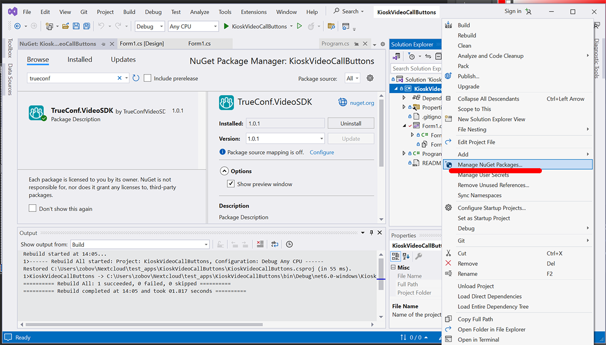
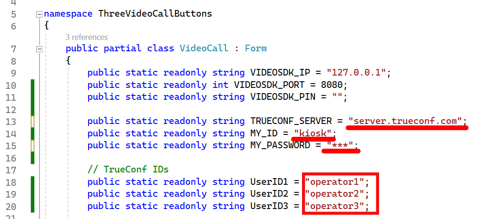
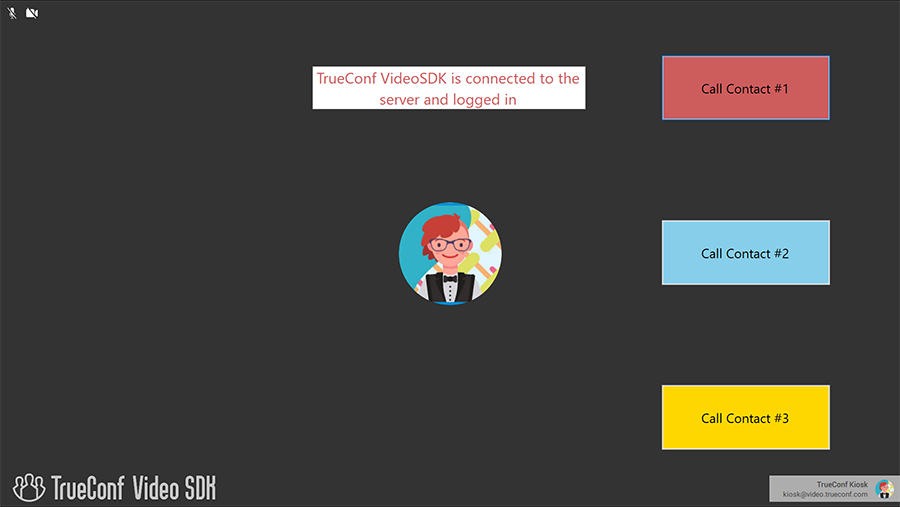

# KioskVideoCallButtons

## System requirements

* Visual Studio 2022+

* .NET 5.0+

* PC that meets [system requirements for TrueConf Room](https://trueconf.com/support/system-requirements.html#trueconf-room) (and by extension VideoSDK)

## Getting ready TrueConf VideoSDK and account data 

1. First of all, you will need a TrueConf Server account that will be used for connecting to the video conferencing server via TrueConf VideoSDK. To learn how user accounts can be added, check the [TrueConf Server documentation](https://docs.trueconf.com/server/en/admin/web-config#users-tab) (accounts can be added manually or through integration with a directory service via LDAP). If you do not have your own TrueConf Server, you can create an account on our test server with the Telegram bot [https://t.me/TrueConfSDKPromoBot](https://t.me/TrueConfSDKPromoBot).

1. Create 3 additional user accounts to test calls from the KioskVideoCallButtons application.

1. [Download TrueConf VideoSDK](https://github.com/TrueConf/pyVideoSDK/blob/main/download.md).

1. Install VideoSDK with default settings (Port = 8080). If 8080 port is already taken , select a different one, but then you will have to change the value of the `VIDEOSDK_PORT` field (check the declaration of the **VideoCall** class in the `Form1.cs` file of this project).

1. Run VideoSDK.

## Install the TrueConf.VideoSDK package

1. Open the KioskVideoCallButtons project in VS Studio.

1. Go to **Project → Manage NuGet Packages**.

1. In the manager pop-up window, select **nuget.org** in the **Package source** list. 

1. Enter **TrueConf** in the search field and click **TrueConf.VideoSDK** in the results.

1. Click **Install** in the pop-up window where the package is described.

Link to the package: [https://www.nuget.org/packages/TrueConf.VideoSDK/](https://www.nuget.org/packages/TrueConf.VideoSDK/)

## Set the required constants

1. Go to `Form1.cs` in the root of the project.

1. Specify the account data of the user created on TrueConf Server: TrueConf ID (login) in the **MY_ID** field, password in the **MY_PASSWORD** field and the TrueConf Server address in the **TRUECONF_SERVER** field. 

1. Specify TrueConf IDs (logins) of three additional accounts, created for testing a call (check [Getting ready TrueConf VideoSDK and account data](#getting-ready-trueconf-videosdk-and-account-data)).

## Run the KioskVideoCallButtons application

Now you can click on any of these three buttons to call one of the users created previously.
